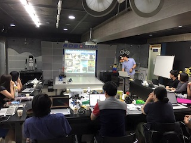

  

## PART 4-5

## PART 4-4
Young Sook Song
11월 13일 오전 12:04
로봇 & 3D 프린터 모델링 & 유니티를 하고 있는 라즈베리스핀 11월 12일 후기
오늘 새로 오신 분이 문화적 충격을 받으신 것 같았는데 그렇습니다.
저희 디자인, 건축, 언어, 미생물, 통계, 법학, 개발을 하는 사람들이 모인 취미++ 모임으로 라즈베리파이, 아두이노, ROS를 거쳐 지금까지 함께 공부하고 있습니다.
그래서 어려운 점도 많았습니다. 아무도 도커 안할 때 도커 도입하고 배포까지 차근차근 밀고 밀고 있는 Sejin Park 님, 김명철 님, 김무성님, Sangjin Sim 님 새삼 감사합니다.
 이런 스터디는 정말 다시 없겠죠?
오늘 발표 맡아주신 곽두환님은 저의 특별한 사부이신데요. 파이썬 기초도 곽두환님께 가장 먼저 들었고 저희 그룹에 깃헙을 도입해 퍼뜨린 정통 문서지기이고
‘아까 그 라디오’를 가져오셔서 아두이노를 퍼뜨린 분이시죠!!
이번에는 블랜더에 떡밥을 확 물어서 오늘 4장부터 끝까지 선행 학습하고 3D 프린터 실물 구현한 결과물까지 가져와서 나누어 주셔서 완전 즐거웠습니다.
드디어 유니티와 블랜더 ABC는 뗀 느낌^^
만들기만 하면 되는데 말입니다!!
날씨가 자꾸 추워지는데 다음 시간엔 로봇과 유니티 특강이 있습니다. 앞으로 파트4와 5도 파이팅입니다.

## PART 4-3
10월 29일 진행한 파트4-3 후기
블랜더 박정은님이 준해 주셨습니다.
깨알같은 준비로 pt 페이지 수가가 어마어마해서 발표하는데
시간 및 공을 많이 들였다는게 느껴졌습니다. pt 준비로 고생이 많았겠다.
빛과 사물, 색감 랜더링등 기초를 다지는 시간이였습니다.
키프레임 애니메이션 만들기 등을 했습니다.
앞애서 발표, 뒤에가서 봐주고 흡사 과외 수업 받는 기분이였다.
블랜더에 숨어 있는 메뉴가 많구나.
난 저렇게까지 준비해서 발표할 자신이 없는데 걱정입니다.
ros 김무성이 준비해 주셨습니다.
도커로 준비해 주셨는데 발표전까지도 도커 파일 준비해 주셔서, 올라가는 중이였습니다.
ros 몇 번 빼먹고 들었는데, 항상 ros는 뭐하는데 쓰는 물건인가
감이 안왔는데 빠르게 훑어보는 ros슬라이드로 설명으로
ros에 대한 감을 잡을 수 있었습니다.
날씨가 추워져서 따듯한 국물에 뒷풀이도 좋았습니다.

## PART 4-2
곽두환
10월 15일 진행한
파트4-2 후기입니다.
유니티만 했구요. 2시간동안 간단한 슈팅게임을 하나 만들었습니다.
YunKyu Choi님이 저번주 블렌더도 감사한데
이번주는 유니티 관련해서 두시간동안 핵심만 짚어 주셨습니다.
두시간 남짓 완전 재밌게 들었습니다.
스터디 하시는 분들이 짝꿍도 만들어서, 서로 끌어주고
, 도와 주는 모습이 훈훈했습니다.한
간단한 모델링부터 초속성으로 슈팅까지 진행되었습니다.
책한권을 봐도 게임을 하나를 만들기 어려운데
짧은 시간동안 군더더기 없는 깔끔한 진행이였습니다.
중요한 것만 골라서 보니 이해가 더 잘 되는것 같았습니다.
아래 동영상은 실습한 유니티 슈팅박스입니다.
좀 더 추가해서 있어 보이게 만들어보았습니다.
안드로이드 apk는 아래에서 다운로드 가능합니다.
https://drive.google.com/file/d/0Bx2HRnvXDiZ5eU9VRjhSVVltN0k/view
아두베리스핀 이미지에 맞추시면 3d모델이 나타납니다.
다음 스터디도 기대가 됩니다.

## PART 4-1
Young Sook Song
10월 10일 오후 3:32
‪#‎로봇‬#3D프린터모델링#유니티 스터디 10월1일후기
로봇 & 3D 프린터 모델링 & 유니티 스터디 첫날이라 세 분야의 도입부가 진행되었습니다.
먼저, 2015년에 나온 뜨거운 책, learning robotics using python은 김덕태님이 첫 문을 열어주셨습니다. 인공지능 전문가분의 남다른 시각으로 책의 체계를 잡아주셨는데 이번 파트에 전문가 포스의 분들이 많이 오셔서 안심도 되고 재미있을 거 같아 기대가 되네요~~
로봇 부분 교재링크:
http://www.amazon.com/Learning-Robotics-Python…/…/1783287535
유니티는 @최홍용님이 설치부터 해 주셨는데 아래 링크에서 다운받으실 수 있습니다.
http://unity3d.com/…/tutori…/projects/space-shooter-tutorial
교재는 절대강좌 유니티입니다. 파이썬이나 C# 그리고 GUI 등으로 할 수 있다고 해서 끌어 주는 사람 있을 때 일단 고!
http://www.yes24.com/24/goods/18848915
YunKyu Choi님은 다른 스터디에서 유니티 스터디 시작한다는 말을 듣고 놀러 오셨다가 저희 보시더니 블랜더와 유니티 교재부터 커리큘럼까지 신경써 주셨는데요. 직접 제작한 데모를 보여줄 때 시각적으로 압도되어 다 같이 함성을 질렀습니다. 로봇 만들때 배경으로나 익힐까 했는데 보다보니 우와~~ 이런 느낌이 있었네요
교재는 블랜더 베이직입니다.
http://www.amazon.com/Blender-3D-Basics-Fisher…/…/1849516901
꼭 이 교재가 아니더라도 블랜더 한글 메뉴얼을 보셔도 될 것 같습니다.
http://wiki.blender.org/index.php/Doc:KO/2.6/Manual
블랜더는 초반에 간단한 에디팅과 프린팅 위주로 1~2회 정도로 마무리하고 나머지 진도를 휘리릭 나가지 않을까 싶은데요. 실습 중심으로 나가다 보니 실력에 따라 발제하는 내용과 진도 등이 조금씩 달라질 수도 있을 것입니다.
혹시 2회차부터 참여 원하시는 분은 다음 모임은 10월 15일로 유니티, 2시간에 끝내기(박스로 슈팅까지) 특강입니다. 특강 있을 때 보시고 참석 여부 결정하셔도 좋을 것 같네요. 뒤풀이 가기는 하지만 저녁 든든히 드시고 오세요. 구경하고 만들고 그리고 하다보니 금방 배고파져서 지난 뒤풀이 닭은 순식간에 모두 배속으로 ~~ ^^ 그럼 다음 목요일에 뵙겠습니다.

## PART 3-3

150724 
**작성자 : 곽두환** **

ROS 후기입니다

ros거북이

ros는 오늘 처음 봤는데 로봇모듈과의 통신같아 보입니다.
독립구성이고 신호를 주고 받는 시스템이랄까
아두이노라면 핀번호를 통한 제한적 통신이라면
ros 좀 더 고급진 명령을 제어 주고 받는 운영체계로 보입니다.
거북이가 엄청 인기가 좋았네요.
이전에 페북에 올라오는 포스팅만 봐도 엄청 멋져 보이긴 했는데
뭔가 움직이니 엄청 인기가 좋았습니다.

로보링크

교육이 대새이긴 한가 봅니다. 로봇이 교육용으로 많이 사용됩니다.
우리 나라 교육시장이 커서 그러한가 봅니다.
비트브릭 ,디오 ,로킷 스마트가 비슷한데
비트브릭 ,디오 와디즈 펀딩에서 보고 구입하여 사용해 보았습니다. 세 제품다 10만정도의 구성이네요
비교를 해보면
비트브릭 http://www.wadiz.kr/Campaign/Details/599
디오 http://www.wadiz.kr/Campaign/Details/828
로킷스마트 https://www.kickstarter.com/…/rokit-smart-build…/description
비트브릭 : 아두이노 호환 + 센서 + 스크레치로만 코딩 가능. 아두이노 못 올림.
디오 : 아두이노 메가 + 센서 + 스크레치 또는 아두이노 변행 코딩 가능하도록 지원
로킷 스마트 : 아두이노 호환 + 센서 + 과학상자?
스크레치 형식의 블럭코딩 앱인벤터로 통한 앱개발도 그렇고
쉽게 교육용으로는 블럭 형식의 개발이 상당히 매력이 있어 보입니다.
어느 정도는 충분히 구현할 수 있고, 대중적인 프로그램 교육 도구가 될 것으로 보입니다.

유니티

로봇과 유니티의 조합으로 같이 구현된 것을 보았는데 상당하 시너지가 있었습니다. 유니티로 화려한 3D 화면을 구성하고 , 제어부로 로봇을 이용한 게임 형태들이 상당히 매력이 있었습니다.
유니티는 3D 게임 전문이였으나 2014부터 모바일 게임 때문인지 2D 대폭지원.
라이센스 정책도 대폭 완화하여 2015 3월 유니티5부터 거의 무료로 오픈.
어느 정도 수익 발생하면 라이센스 비용 지불하는 형태입니다.
유니티 하기에 좋은 시기인거 같습니다.
3D 때문에 볼려고 했던거는 아니고 2D형 모바일앱을 만들면 멋지지 않을까해서 살펴보고 있었는데 유니티는 상당히 매력이 있어 보입니다.

**작성자 : 김무성**

이번엔 후기를 두 분에게 부탁했습니다. 기술적 소감은 곽두환님이 써주셨고, 생생한 체험기는 박정은님이 써주실거니까, 전 개인적인 견학기만 짧게 쓸께요~

이번엔 Sejin Park님의 섭외로, 로보링크로 가서 스터디를 하고, 이현종(Robert Lee)님의 특강도 들었습니다. 저는 아무런 정보가 없는 상태였는데, 특강의 시작은 '마술!'이어서 깜짝 놀랬습니다. 그리고 이어지는 '밴드', 마무리는 '로봇'!. 물론 이 3가지는 한 사람 안에서 동시에 존재할 수 있습니다. 취미로, 관심으로, 일로. 하지만 이것들이 먹고사니즘의 밀착된 '로봇'에 모두 결합되고 있는 것을 보면서 정말 깊은 감명을 받았습니다. 마술하는 로봇! 음파에 반응하는 로봇 밴드단!

아두베리스핀도 모두 다양한 배경의 사람들이 모여서 그저 재밌어 보인다는 것만으로 이것저것 하고 있습니다. 그래서 이현종님에게 스터디원들이 자기소개를 할 때 나름 - '우리의 다양함에 놀라게 될꺼야'라고 자부했는데, 마술,락밴드,로봇 3연타에 그냥 아웃. ㅋㅋㅋㅋ 그리고 이어지는 무수한 아이디어와 그 구현들. 정말 재미난 시간이었습니다. 설정샷으로 '부러움의 아이콘' 김덕태님 시리즈 사진들을 찍었는데요~ (세진님이 여러가지 경품을 타서 그걸 부러워하며 바라보는 설정) 사실은 완전 제 마음이었습니다. 장난감같던 그 로봇, 그러나 사실 진짜 장난감이던. 그러면서 진짜 로봇이던 그것들을 뒤로 하고 집에 돌아갈때의 그 아쉬움이란. 그래서 기회가 날때마다 좀 초청도 하고 놀러도 가고 하자며 모두들 입을 모았습니다.

재미난 시간이었습니다. 섭외해주시고 초대해주시고, 참여해주신 분들 모두 감사합니다~ 이상 견학기를 마칩니다.

**작성자 : 박정은**

"옛날옛날 어느 비오는 오후 송영숙님이 배 위에서 낚시를 하고 있었습니다."
아두베리스핀호 항해 초기에 LED 한번 켜보고 실종됐던 사람 중의 한 명인 박정은입니다. 곽두환 님이 실종자 대표로 화살받이가 되어 주셔서 열심히 가만히 있었습니다.
늘 그렇듯 실질적으로 도움은 안되고 느낌만 있는 후기 투척합니다.
저는 김밥 미끼를 덥석 물어 송한나님, 송치성님과 함께 아두베리스핀호에 재승선하게 되었습니다. 지은지 30년 된 신화플래닛 본사 B1 로보링크 체험학습장에 도착하여 김밥을 먹어치우고, 김무성님의 docker 환경에서 거북이 생성법 발제를 들었습니다.
저는 그날 ROS를 처음 들었기 때문에 기술적인 내용은 전혀 이해를 못했습니다. 죄송합니다. 하지만 boot2docker를 이용하여 심상진님, 송영숙님, 박세진님, 송준호님이 차례차례 거북이를 띄우고 애지중지하는 모습을 보면서 뭔가 나도 거북이를 만들어야 될 것 같다는 생각이 들기 시작했습니다.
김덕태님과, 오랫만에 뵌 정우철님이 거북이를 못보셔서 시무룩해 계실 때쯤 막간을 이용하여 세진님께서 ROS with Docker 5분발표를 해주셨습니다. 로열모(로봇공학을 위한 열린 모임)에서 발표를 못하신 한을 푸셨기를 바랍니다. ㅎㅎ 그 후, 최근 중&미에서 국빈대접을 받고 계시는 로보링크 대표 이현종님께서 드디어 입을 여셨습니다.
이현종님은 로봇공학 전공자로서 잘나가는 직장을 때려치고 초기자본금 200만원으로 마술사, 록밴드 등을 전전하며 파란만장한 인생을 살아오시다가 신화플래닛에 입성하였으나 10년간 국내시장에서 고전했다고 합니다. 그러나 최근 6개월만에 해외에서 대박을 터뜨리고 그 끝에 만난 행운의 여신 박세진님과의 인연으로 특강을 해주시게 되었으며, 그 결과 김무성님의 빨판에 붙잡혀 앞으로 각종 스터디에 폭풍 초대되실 것으로 예상됩니다.
이어 그간 만들었던, 그리고 현재 만들고 계신 여러 로봇 시연을 해주셨습니다. 요즘 중국에서 인기폭발이라 출국하실 때마다 두개씩 업고 가신다는, 음악에 맞춰 빛을 내며 움직이는 밴드로봇, 초딩들에게 인기 최고인 키넥트를 이용한 따라쟁이 로봇(정식 명칭은 아님), 3년 내 세계마술사대회 참가를 목표로 구축중인 마술로봇, 마지막으로 특강을 위해 로보링크 직원분들이 만들어 주셨다는(감사합니다) 아바타 게임 등등등...또한 매주 토요일마다 이곳에서 청소년을 대상으로 하는 로봇교육을 지속한 결과 로봇 전공으로 세계 유수의 명문대에 입학한 제자들이 많다는 얘기도 인상적이었습니다. 
시연이 진행되는 동안 저는 그룹원들의 눈에서 별이 튀어나오고 그들의 얼굴이 천진난만한 초딩으로 회귀하는 현상을 목격하고 속으로 할렐루야를 외쳤습니다. 그리고 조금 무섭다고 생각했습니다. 로봇! 로봇이 뭐관대, 격무에 지친 직장인들을 날뛰게 하는고.
이번 특강의 공로자이신 세진님께서 마지막에 "오늘 마치 꿈을 꾸다 온 것 같아요"라고 소회를 밝혀주셨습니다. 세진님께서 꿈을 좇는 여정에 쫄래쫄래 따라가다가 떡이 생기는 사람들이 많은 듯 하니, 꼭 교육 기능이 탑재된 로봇청소기를 구현하시길 바랍니다.

## PART 3-1
150625 권갑진
오랜 시간을 기다린 끝에 첫번째 모임이 있었습니다.
스터디 모임의 첫날에 모든 중요한 것이 발표된다는 것 같습니다. 스터디 첫날은 필참인 거 같습니다. 그러나, 다음에라도 참석하면 다들 도와 주시니 안심하시길...
다행히 첫날 시간이 되어 참석한 결과, 김명철님의 ros 설치 방법 및 시운전, 이어지는 라즈베리 파이에 ros 설치 한방에 하기, 도커로 ros 한번에 깔아서 시험하기를 하루에 모두 보여주시는 명강의를 수강하는 행운을 얻었습니다. ros 설치는 명철님의 마법의 2줄의 주문으로 해결 가능하였고, 이어지는 ros 설정 및 구동에 이어 거북이 시뮬레이터를 바로 이어서 보여주어 설치 후 테스트까지의 설치의 전과정을 한번에 보여주셨습니다. 이어서 두번째는 라즈베리 파이에 ros 설치 과정 복잡했습니다만, 다행히 최근에는 우분투가 나와서 쉬워졌다고 합니다. 세번째는 ros 도커를 받아서 바로 구동하기 편.. 여러 ros 도커 이미지를 받아보신 결과 제대로 잘 작동하는 것을 발견해서 도커 설치 부터 ros 도커 이미지 받기 및 구동을 통해 ros를 쉽게 구동하는 방법을 보여주셨습니다. 중간 중간 이어지는 리눅스 및 도커, ros 꿀팁이 이어져 정말 충실한 강의의 모범을 보여주셨습니다. 도커 다운로드로 시간이 소요되는 중간에 개인 과제 주제를 발표하셨는데 개인 프로젝트로 상당히 다용도 기능을 수행할 수 있는 라즈베리파이 기반의 로봇을 발표하셨습니다.
두번째 세션에서는 박세진님의 개인 프로젝트 대신 열린 로봇 모임 5분 스피치 시간에 발표할 자료를 미리 발표했습니다. 도커 및 쥬피터를 이용한 재현가능한 ros 프로젝트 공유를 주제로 멋진 아이디어를 발표 해주셨습니다. 최종 발표자로 선정되지 않았지만 오늘 발표로 준비한 보람이 있으셨을 거 같습니다. 또한 ros 치트 자료를 손수 인쇄해서 나눠주셨는데, 마치 로봇을 마음대로 부릴 수 있는 마법의 주문서를 손에 넣은 기분입니다.
세번째 세션에서는 정우철님의 개인 프로젝트 발표가 있었습니다. connectomeengine.com에서 제공하는 자료를 기반으로 최초의 인공생명체의 구현물을 재현해 보시고 싶다고 하셨습니다. 평범해보이시는 개발자도 바이오와 로봇을 아우르는 융합 로봇을 주제로 개인 프로제트를 하시다니 정말 대단한 융합 로봇 스터디임에 틀림 없습니다.
이상은 부정기 참석 멤버로 다행히 첫회 모임에 참석해서 발견한 멋진 융합 로봇 스터디의 첫날 모습을 담은 후기였습니다.

## Part 2-5
150430 조강익
아두이노 + 병렬처리 후기입니다.
뉴로파이썬에서 넘어온 조강익입니다.
뉴로파이썬에서 낚시발표로 병렬처리 파트가 있다는 내용을 듣고 참여했습니다 ㅋㅋㅋ
김명철님께서 Celery로 먼저 발표를 시작했습니다.
Celery는 분산시스템 구축을 위한 프레임 워크이고 장단점을 먼저 설명해주셨습니다. broker / backend 개념을 쉽게 설명해주시고, 실습으로 넘어가게 되었는데 중간 중간 나오는 질문들을 바로바로 설명해주시는 모습이 마치 실무에서 celery를 사용하고 계시는 분처럼 느껴졌습니다.
Worker 마다 queue를 specify할 수 있고, queue 순서까지도 조절 할 수 있는 것이 매력적으로 보였습니다. pp에 비해서 옵션을 넣기가 편리해 보였고, redis와 연동하여 ip를 직접 입력하지 않고도 자동연결 되는 기능도 좋아보입니다.
병렬처리를 사용해야 하는 분야가 점점 늘고 있고, 제 분야도 그중 하나이기 때문에 바로 적용할 수 있는 매우 실용적인 발표내용이었습니다. 바이오 스핀 참여하면서 다른 스터디들 발표 퀄리티는 어떨까 궁금했는데 역시나 고퀄 이군요...
조금 쉬고 박세진님께서 아두이노 + PCR 발표를 하셨습니다.
전 아두이노? 이걸 처음봐서... 모니터에 연결되어 리눅스가 뜨는 것 까지도 신세계였습니다. 하지만 이걸로 이것 저것 할 수 있는 걸 듣다가 PCR 머신도 만들수 있다는 이야기에... 세상이 이렇게 빨리 바뀌는걸 따라갈 수 있을까...? 나는 누구인가...? 저녁은 뭐먹었더라...? 등등 영혼이 잠시 빠져나갔습니다. 
Central dogma 부터 DNA 증폭까지 20분만에 학부 한학기를 쫘악 보여주셨고 마지막엔 pipette에서 팁을 빼는 것이 너무 리얼했던 가상 PCR 실험 플래쉬를 보여주시면서 끝내셨습니다. 병렬처리 들으러 왔다가, ‘이제 다 이루었도다’ 했는데 뒷부분도 너무 재밌었네요.
'일주일에 두번 스터디를 오다니 !!’ 하고 왔는데 
훈련소만 아니었으면 두번으로 고정 될 뻔했습니다.
재밌는 발표해주신 두분께 감사합니다 !

## Part 2-4
150416
뒤늦은 스터디 후기 올립니다.
간단하게 인상깊었던 부분을 적도록 하겠습니다.
첫번째로 무성님의 발표가 있었습니다.
IPC 및 RPC에 대해 좀 더 생각해 볼수 있는 기회가 되었습니다.
아울러 대망의 ppserver를 이용한 RPC 실행예제가 인상 깊었고 신기했습니다.
일단 ppserver를 설치해보고픈 충동이 들었었습니다.
두번째로 세진님의 아두이노 발표 !!!
조도센서를 이용한 실습을 통해 센서에 대해 눈을 뜬 시간이기도 했습니다.
센서는 많을수록 좋다? 라는 생각이 문득 들기도 했었습니다.
고생해서 준비해주셔서 감사합니다.
아울러 맛있는 순대를 제공해주신 영숙님께 감사!!!
항상 든든하게 백업을 해주시는 상진님께 감사 !!!
참석하셨던 모든 분들 수고 많으셨고~ 다음 스터디 때 뵙도록 하겠습니다 ^^

## Part 2-3
작성자 : 심상진 

2015년 4월 2일 아두베리스핀 후기
너무 늦었네요. -ㅅ-;; 후기를 남기는게...
다른 모임도 마찬가지겠지만, 왠지 몇회만 지나면 조촐하게 변하는 아두베리스핀 모임이라는 생각입니다. 그날은 많은 비에 천둥번개까지 치던 악천후의 날이었습니다.
하지만, 아두이노+라베를 배우겠다는 열의를 가진 3분의 용자분(?)들이 보여서 열심히 공부를 하는 뜻깊은 시간을 가졌습니다!!
첫시간은 김명철님의 아두이노로 시작했습니다. 아두이노가 가진 입출력 핀에 대한 설명과 함께 PWM에 대한 설명을 ipython에 잘 정리된 문서로 설명해주셨습니다. PWM에 대한 설명은 사실 어려울수도 있었는데, 외부에서 찾으신 문서를 보여주시면 이해하기 쉽게 설명을 해주셨습니다.
이후로 ipython위에 돌아가는 아두이노 시뮬레이터를 이용하여 PWM및 아날로그 아웃풋의 동작에 따라서 LED밝기를 조절하는 예제와 작은 LCD를 연결하여 LCD위에 데이터를 보여주는 예제를 보여주고, 마지막 예제의 경우 직접 아두이노를 이용하여 연결하여 Text를 뿌려주는 부분까지 보여주었습니다. 참고로 책에서의 LCD연결 방법이 복잡하고 어려워서 별도로 찾은 연결법을 이용하여 연결하여 보여주시는 모습이 인상적이었습니다.
두번째 시간은 박홍훈 님께서 병렬처리에 대해서 이야기해주셨습니다. Program Control Block에 대한 설명과 함께 multiprocessing및 파이썬의 몇가지 병렬처리 라이브러리를 설명해주셨습니다. 
Linux기준으로 설명된 책이라서 Windows에서는 실행 불가라 박홍훈님께서 VM위에 Linux를 올려놓아 거기서 ipython을 이용해서 설명해주셨는데,
인상 깊었던 것은 zeromq에 대한 설명이었습니다. 요즘에 데이터 전송에 대해서 안정적으로 하는 방법에 대해서 알아보고 있는 중이었는데 zeromq의 경우 데이터 전송 중간에 중단되어도 queueing하고 있다가 나중에라도 연결되면 보내주는 식으로 데이터의 손실을 줄여주는 것을 관리해주는 부분들이 있고, 그외에 여러가지 기능들에 대해서 친절히 설명해주셨습니다.
마지막으로 zeromq를 이용하여 두가지 이상의 언어로 작성된 서로다른 프로그램에서 데이터 통신을 하는 것을 데모로 보여주셨습니다.
나름 많은 것을 배운 시간인 듯 합니다!!
내일이 기대되네요!!

## PART II-2
20150319
작성자 : 김명철 

어제 스터디는 정말 흥미 진진 했었습니다.
아두이노계의 숨은 실력자셨던 임종혁님의 발표로 시작하였습니다.
기본적인 부품의 설명과 
모두의 지름 욕구를 자극한 must have item의 소개 !!! 
그리고 진격의 led 220볼트 릴레이로 마무리 되었습니다.
많은 자극을 받았던 시간이였습니다.
병렬 프로그래밍에서는 강양제님과 조근영님의 예제 실행 부분이 기억에 많이 남았었습니다. 
그리고 박홍훈님과 황재문님의 백업으로 프로그램과 프로세스 스레드에 대해 확실하게 알아볼 수 있는 유익한 시간이였습니다.
역시 저희 스터디엔 숨어있는 고수 분들이 많으셨습니다 !!
발표를 준비해주셨던 모든 분들 고생 많으셨고 어려운 시간내서 참가해주셨던 모든 분들도 수고 많으셨습니다. ^^

## PART II-1
20150304
작성자 : 심상진 
아두배리스핀 + 파이썬 병렬 프로그래밍 후기(3월 4일) 1회차
처음 써보는 것이라 두서없이 작성할 수 있는데 양해부탁드립니다 ㅜㅜ
사실 초반에 많이 걱정했습니다. 주제를 잘못섞었나해서요. 그런데 오신분들보니 걱정이 기우였다는 것을 알았습니다. 
처음에 시간이라 앞으로의 진행방향과 진행방식에 대해서 설명드리고 아이스브레이킹으로 자기 소개시간을 가졌습니다. 정말 다양하신 분들이 오셨습니다.
그리고 드디어 조근영님은 파이썬 병렬처리 프로그래밍 강의로 첫 시작을 했습니다.
기억에 남는 건 이병헌 사진이 가장 기억에 남았고 제가 생각하기에 가장 이해하기 쉬운 예를 들어주셨다고 생각합니다. ㅋㅋ
어째든 그러한 것을 시작으로 병렬처리의 기본적인 용어들 및 내용들을 이야기하시고, 파이썬의 gil문제등의 언급 및 극복방안들에 대해서 수집한 여러자료들을 적절히 보여주시면서 설명해주셨습니다.
아두이노는 첫시간이라 아두이노에 대한 간단한 설명, 그리고 ide 설치방법등에 대해서 간략하게 설명하고 끝맞쳤습니다.
이후 가장 백미였다고 생각하는 뒷풀이 시간을 통해서 다시한번 인사하는 자리를 가지면서 다양한 이야기를 했습니다.
개인적으로는 재미있는 시간이었다고 생각합니다.!!

## PART 1-5회차
박홍훈
1월 25일 오후 4:39
2015.1.22 목요일 늦은 후기
‎아두베리스핀_후기‬
이번 모임에서의 아두이노 주제는 모터제어와 거리센서 이용이였습니다.
처음 주제는 미니 선풍기를 제어하는 것이였는데... 계절이 계절이니 만큼
미니 선풍기를 구할수가 없어서... 간단한 dc 모터 제어를 하였고...
dc 모터가 잘 돌아가는 것을 확인하고.. 거리센서를 연동하여
거리에 따른 모터 회전수 제어를 하였습니다..
모터를 제어하니.. 엄청나게 할게 많아지는 상황이 되어서... 옹기종기 모여서 다양한 상상의 나래를 펼치고 이야기 꽃을 피웠습니다.
스터디 마치고 순대국집에 들러서 늦은 저녁식사를 같이 하면서 스터디 파트 2에 대한 얘기 할때, 더 이상 Sangjin Sim님에게만 부담 주지 말자는 의견하에, 돌아가면서 교재책을 발표하면서 자기가 하고 싶은게 있으면 그냥 부담없는 선에서 추가 발표하자고 했습니다.
이왕에 아두베리스핀 스터디 하는김에 한발짝 가다가 넘어지는 로봇이라도 만들자는 각오로 스터디를 계속 하자는 분위기 였습니다..
모터제어를 배우고 난 후에...제가 다음에 하고 싶은 것은... 유트브에서 본
정말 간단한 보트 입니다...
ㅋㅋㅋ
http://www.youtube.com/watch?v=gtWWoHE9Iws
다음에 3d 프린터를 마지막으로 파트 1을 마치고 파트 2를 기대합니다...

## PART 1-4회차
Young Sook Song
2015년 1월 9일 오전 1:15
‪‎아두베리스핀‬ 라즈베리파이로 꼬마전구 만들기
오늘은 내내 보고 듣는 즐거움이 컸는데 글로 쓰는 후기로 전달이 잘 될지 모르겠네요. 먼저, 발제를 준비해주신 곽두환한님께서는 그룹의 문서지기이기시도 하신데요. 그래서 깃허브에도 라즈베리 이미지랑 딱 맞은 분위기를 샤샤샥 만들어 놓고 오셨더군요. (직접 확인해 보세요)
라즈베리파이의 바탕화면은 ‘스크레치’를 포함한 재미있는 게임들과 파이썬 등이 있어서 시킨 일은 잘할 수 있는 미니컴퓨터 같았습니다. 하지만 라즈베리파이로 제어하는 로봇의 동영상을 포함한 영상들과 직접 만드신 ‘광고는 제거하고 노래만 들려주는 라디오’, ‘LED 조명과 카메라를 장착해 만든 식물 키우기 프로젝트’ 등을 보면서 쏟아지는 질문들과 아이디어들을 들으니 쉽게 뭐라도 하나 만들 수 있을 것 같다는 느낌이 들었습니다. 그리고 4줄 정도의 코드를 바꿔가면서 전구의 불이 들어올 때는 다 같이 박수를 치면서 즐거워했습니다. (이 때쯤 일에서 오는 스트레스를 힐링할 목적으로 스터디에 간 저는 관전 모드를 멈추고 슬금슬금 인터넷을 켜서 지름신을 받아들이고 있었습니다.)
실습 시간에도 아이디어와 질문들이 계속됐고 ‘라즈베리파이세트’ 선물 증정도 있어서 분위기는 더욱 고조되었습니다. 준비가 덜 되신 분은 문방구에서 사오고 가까이 있는 회사에 가서 키보드 들고 오는 등 꼭 성공시키겠다는 열의는 월드컵 한일전 경기 보려는 남학생들이 학교에 텔레비전 들고 오는 느낌이었습니다.^^
결론: 라즈베리파이 작지만 막강하고 가격 대비 많은 일을 하는 아이네요. 요즘 그룹에 ‘차라리 내가 만든다.’ 바람이 불고 있는데 저는 꾸준히 ‘ 차라리 만들어 주면 쓰겠다’ 로 버티고 있었는데 만드는 재미가 쏠쏠할 거 같은 느낌이 듭니다!
팁: 점점 욕심이 나서 큰 걸 만들어 보고 싶으신 분들만 보세요. 만 원 정도를 더 쓰면 설치, 납땜 등의 고통을 피해갈 수 있습니다. 직접 하고 싶다면 연습을 많이 해야겠죠? 어릴 때 오빠가 납땜하는 게 재미 있어보여서 따라 해본 기억이 있는데 모든 기계에는 ‘쓸고 조이고 기름칠 한다’는 원칙이 있습니다. 납땜도 비슷한 것 같습니다. 납땜할 곳과 인두에 먼지 제거하고 한 방울 위치 잡고 다시 한 방울 이렇게 연습했던 것 같습니다. 올 해는 모든 분들이 하고자 하는 일들을 모두 이루시기를 바라면서 하수의 당돌한 후기 마칩니다. 다음에는 제 전구에도 불이 반짝 들어와야할텐데 말입니다.^^

## PART 1-3회차
조근영
2014년 12월 12일 오전 9:55
- 개인 프로젝트를 하게 되면 일단 '목표'가 설정이 되기 때문에 동기 부여에 가장 좋습니다. 제가 강의를 하면서 느낀 점은 '목표'가 없는 사람이 꽤나 된다는 것. 현실적으로 자신의 능력을 정확히 파악하고 그것보다 약간 어려운 단계를 진행하게 되면 미하이 칙센트미하이 교수가 말한 'flow'(몰입, 제 아이디도 여기에서 영감을 얻음, realflow)를 경험하게 됩니다. 자신의 능력을 과대 평가하거나 자신의 능력보다 매우 어렵거나 쉬운 일을 하게되면 몰입을 할 수 없고 지루해 하거나 매우 어려워 합니다.
- 가장 좋은 것은 자신의 능력대비 약간 어려운 것을 차근 차근 단계를 밟아나가면서 마스터하여 1만 시간을 채우는 순간 그 분야의 장인으로 다시 태어날 수 있다고 믿습니다.
- 이렇게 발표를 함으로써 다른 사람의 의견을 듣게되니 +@ 가 발생하는 것 같습니다. 서로 자신의 아이디어를 다시 한 번 확인해 볼 수 있고 고수분들께서 코멘트를 달아주시니 훨씬 좋은것 같습니다. 또한 다양한 분야의 사람들이 존재하기 때문에 다양한 시각을 볼 수 있는 기회가 되었습니다.
- 이 같은 상황이 가능한 이유는 첫째, 현업에서 하드웨어를 다루는 분이 있다는 점. 그 분들의 한 마디는 초보들의 수 많은 시행착오를 절약하게 만듭니다. 둘째, 만들고자 하는 의지라고 봅니다.
- 대학교에서 과제하던 것과는 다르죠. 대학교 과제는 자발적인게 아니라 타의적인 것, 피드백을 줄 수 있는게 교수밖에 없고 교수조차 실무 경험이 부족하기 때문에 현실적인 피드백을 받을 수 없다는 점 등이라 생각 됩니다.
- 제가 들었던 것 중에서 관심있던 것은 교류 제어, 아두이노 오디오북, 개인 생장상 등입니다.
- 아버지께 '자동화는 이런 것이다!' 라고 3달 후에 말씀 드리면 참 좋겠네요!

## PART 1-2회차
[아두베리스핀 2차] 11월 27일 스터디후기
Starbuck Sb
2014년 11월 28일
안녕하세요. 스터디에 참가한 김선우입니다.
먼저 저번 모임보다 훨~씬 많은 분들이 오셨습니다!
(친구랑 모임이 있어서 한시간 정도 늦게 수업에 들어갔습니다.. u.u)
강의실에 들어가니 박홍훈 강사님이 파이썬 기초문법에 대해서 강의를 하고 계셨습니다. 저는 인터넷에 있는 파이썬자료보면서 혼자 예제따라해보는 식으로 공부하고 있는데요. 강사님이 요점만 딱딱 찝어서 설명해주셔서
'역시 고수분들께 배워야 하는구나...'라는 점을 느꼈습니다..
기초문법 강의후에는 python, ipython, ipython notebook 설치에 대해서 강의를 해주셨습니다. 저 같은 초보자에게는 파이썬 설치 및 기타 필요한 패키치 세팅부터 막막한데 쉽게 설치하는 법 알려주셔서 너무 감사했습니다. 사실 저는 캐노피로 파이썬을 쓰고있는데 캐노피나 아나콘다로는 한계가 있다고 하셔서 주말에 싹 지우고 알려주신대로 차근차근 다시 설치해보려고 합니다. ㅎㅎ
그리고 ipython notebook의 활용에 대해서 설명해 주셨는데 다음에 만약 시간이 되시면 실제로 활용하는 것을 한 번 보여주셨으면 합니다. 저도 잘 몰라서 옆자리에 계신분한테 여쭈어보니까 그 분도 활용법은 모른다고 하시더라구요..아마 저같은 분이 몇 분 더 계시지 않을까 해서요 ㅎㅎ
마지막으로 아두이노 관련 동영상 하나 소개해 드리겠습니다.
첨부한 동영상은 국내 어느 능력자분께서 개발하신 아두이노IDE입니다. 센서에서 읽은 데이터를 그래프로 나타내려면 프로세싱이나 파이썬으로 나타내주어야 하는데 이 IDE에서는 그냥 바로 그래프로 보여주고 있습니다..다음 달 안에 0.1버전을 릴리즈 하신다고 하네요...(바쁘신 분은 8분부터 보셔도 됩니다.)
출처 : 아두이노 스토리 네이버 까페
http://www.youtube.com/watch?v=4PwpX8AMFWo#t=505

## PART 1-1회차
이선영
2014년 11월 14일
아두베리스핀 첫번째 모임, 후기입니다:)
조금 늦게가서 자기소개는 두번밖에 못했네요!
아두이노, 라즈베리파이는 들어보기만 했고, 컴공임에도 python 사용법을 잘 몰라 실습시간에 당황했었는데 많이 도와주셔서 재미와 깨달음 모두 얻은 시간이었어요
기본 셋팅부터 큰 난관에 부딪힌 것 같았는데 아직은 걸음마 단계라고 생각하고 자연스럽게 생각하려구요^^; 고수님들의 도움으로 겨우겨우 한걸음 한걸음 나아가고있습니다.
본격적으로 실습에 들어가면서 실습에 필요한 부품들에 대해 공부하고, 터미널이랑 아두이노 이용해서 python코드도 돌려보고 하는데 다 알고가자면 머리가 터질 것 같아서.. '이렇게 하는거구나~' 정도로 하자고 생각하니 한결 마음이 편해지더라구요. 그래도 어느정도 시간이 지나면 나도 다른사람들에게 도움을 줄 수 있기를..하고 욕심내봅니다
오늘 상진님의 열정적인 강의 최고였어요!! 열정적인 리액션 덕분에 전기회로를 즐겁게 배울 수 있었어요. 그리고 함께하는 사람들도요. 스터디가 이렇게 즐거울 수 있다는 것을 처음 알았습니다. 집이 멀어서 막차 신경써야 하는데 늦게 일어서면서도 이렇게 아쉬울 수 있나 싶어요.
스터디 끝나고 집에와서 오늘 한 내용을 다시보니 처음 볼때와는 느낌이 다르더라구요. 격주로 재미있게 하는 내용이지만 제대로 해보고싶다 라는 생각이 들었어요.
다음 모임이 벌써부터 기다려지네요. 긍정적인 에너지를 발산하는 여기는 정말.. 최고입니다ㅋ_ㅋ!

