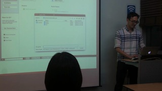

## PART 3-1회차 
권갑진
6/25일 1회차 스터디 후기

오랜 시간을 기다린 끝에 첫번째 모임이 있었습니다.
스터디 모임의 첫날에 모든 중요한 것이 발표된다는 것 같습니다. 스터디 첫날은 필참인 거 같습니다. 그러나, 다음에라도 참석하면 다들 도와 주시니 안심하시길...
다행히 첫날 시간이 되어 참석한 결과, 김명철님의 ros 설치 방법 및 시운전, 이어지는 라즈베리 파이에 ros 설치 한방에 하기, 도커로 ros 한번에 깔아서 시험하기를 하루에 모두 보여주시는 명강의를 수강하는 행운을 얻었습니다. ros 설치는 명철님의 마법의 2줄의 주문으로 해결 가능하였고, 이어지는 ros 설정 및 구동에 이어 거북이 시뮬레이터를 바로 이어서 보여주어 설치 후 테스트까지의 설치의 전과정을 한번에 보여주셨습니다. 이어서 두번째는 라즈베리 파이에 ros 설치 과정 복잡했습니다만, 다행히 최근에는 우분투가 나와서 쉬워졌다고 합니다. 세번째는 ros 도커를 받아서 바로 구동하기 편.. 여러 ros 도커 이미지를 받아보신 결과 제대로 잘 작동하는 것을 발견해서 도커 설치 부터 ros 도커 이미지 받기 및 구동을 통해 ros를 쉽게 구동하는 방법을 보여주셨습니다. 중간 중간 이어지는 리눅스 및 도커, ros 꿀팁이 이어져 정말 충실한 강의의 모범을 보여주셨습니다. 도커 다운로드로 시간이 소요되는 중간에 개인 과제 주제를 발표하셨는데 개인 프로젝트로 상당히 다용도 기능을 수행할 수 있는 라즈베리파이 기반의 로봇을 발표하셨습니다.
두번째 세션에서는 박세진님의 개인 프로젝트 대신 열린 로봇 모임 5분 스피치 시간에 발표할 자료를 미리 발표했습니다. 도커 및 쥬피터를 이용한 재현가능한 ros 프로젝트 공유를 주제로 멋진 아이디어를 발표 해주셨습니다. 최종 발표자로 선정되지 않았지만 오늘 발표로 준비한 보람이 있으셨을 거 같습니다. 또한 ros 치트 자료를 손수 인쇄해서 나눠주셨는데, 마치 로봇을 마음대로 부릴 수 있는 마법의 주문서를 손에 넣은 기분입니다.
세번째 세션에서는 정우철님의 개인 프로젝트 발표가 있었습니다. connectomeengine.com에서 제공하는 자료를 기반으로 최초의 인공생명체의 구현물을 재현해 보시고 싶다고 하셨습니다. 평범해보이시는 개발자도 바이오와 로봇을 아우르는 융합 로봇을 주제로 개인 프로제트를 하시다니 정말 대단한 융합 로봇 스터디임에 틀림 없습니다.
이상은 부정기 참석 멤버로 다행히 첫회 모임에 참석해서 발견한 멋진 융합 로봇 스터디의 첫날 모습을 담은 후기였습니다.

## PART 1-5회차
박홍훈
1월 25일 오후 4:39
2015.1.22 목요일 늦은 후기
‎아두베리스핀_후기‬
이번 모임에서의 아두이노 주제는 모터제어와 거리센서 이용이였습니다.
처음 주제는 미니 선풍기를 제어하는 것이였는데... 계절이 계절이니 만큼
미니 선풍기를 구할수가 없어서... 간단한 dc 모터 제어를 하였고...
dc 모터가 잘 돌아가는 것을 확인하고.. 거리센서를 연동하여
거리에 따른 모터 회전수 제어를 하였습니다..
모터를 제어하니.. 엄청나게 할게 많아지는 상황이 되어서... 옹기종기 모여서 다양한 상상의 나래를 펼치고 이야기 꽃을 피웠습니다.
스터디 마치고 순대국집에 들러서 늦은 저녁식사를 같이 하면서 스터디 파트 2에 대한 얘기 할때, 더 이상 Sangjin Sim님에게만 부담 주지 말자는 의견하에, 돌아가면서 교재책을 발표하면서 자기가 하고 싶은게 있으면 그냥 부담없는 선에서 추가 발표하자고 했습니다.
이왕에 아두베리스핀 스터디 하는김에 한발짝 가다가 넘어지는 로봇이라도 만들자는 각오로 스터디를 계속 하자는 분위기 였습니다..
모터제어를 배우고 난 후에...제가 다음에 하고 싶은 것은... 유트브에서 본
정말 간단한 보트 입니다...
ㅋㅋㅋ
http://www.youtube.com/watch?v=gtWWoHE9Iws
다음에 3d 프린터를 마지막으로 파트 1을 마치고 파트 2를 기대합니다...

## PART 1-4회차
Young Sook Song
2015년 1월 9일 오전 1:15
‪‎아두베리스핀‬ 라즈베리파이로 꼬마전구 만들기
오늘은 내내 보고 듣는 즐거움이 컸는데 글로 쓰는 후기로 전달이 잘 될지 모르겠네요. 먼저, 발제를 준비해주신 곽두환한님께서는 그룹의 문서지기이기시도 하신데요. 그래서 깃허브에도 라즈베리 이미지랑 딱 맞은 분위기를 샤샤샥 만들어 놓고 오셨더군요. (직접 확인해 보세요)
라즈베리파이의 바탕화면은 ‘스크레치’를 포함한 재미있는 게임들과 파이썬 등이 있어서 시킨 일은 잘할 수 있는 미니컴퓨터 같았습니다. 하지만 라즈베리파이로 제어하는 로봇의 동영상을 포함한 영상들과 직접 만드신 ‘광고는 제거하고 노래만 들려주는 라디오’, ‘LED 조명과 카메라를 장착해 만든 식물 키우기 프로젝트’ 등을 보면서 쏟아지는 질문들과 아이디어들을 들으니 쉽게 뭐라도 하나 만들 수 있을 것 같다는 느낌이 들었습니다. 그리고 4줄 정도의 코드를 바꿔가면서 전구의 불이 들어올 때는 다 같이 박수를 치면서 즐거워했습니다. (이 때쯤 일에서 오는 스트레스를 힐링할 목적으로 스터디에 간 저는 관전 모드를 멈추고 슬금슬금 인터넷을 켜서 지름신을 받아들이고 있었습니다.)
실습 시간에도 아이디어와 질문들이 계속됐고 ‘라즈베리파이세트’ 선물 증정도 있어서 분위기는 더욱 고조되었습니다. 준비가 덜 되신 분은 문방구에서 사오고 가까이 있는 회사에 가서 키보드 들고 오는 등 꼭 성공시키겠다는 열의는 월드컵 한일전 경기 보려는 남학생들이 학교에 텔레비전 들고 오는 느낌이었습니다.^^
결론: 라즈베리파이 작지만 막강하고 가격 대비 많은 일을 하는 아이네요. 요즘 그룹에 ‘차라리 내가 만든다.’ 바람이 불고 있는데 저는 꾸준히 ‘ 차라리 만들어 주면 쓰겠다’ 로 버티고 있었는데 만드는 재미가 쏠쏠할 거 같은 느낌이 듭니다!
팁: 점점 욕심이 나서 큰 걸 만들어 보고 싶으신 분들만 보세요. 만 원 정도를 더 쓰면 설치, 납땜 등의 고통을 피해갈 수 있습니다. 직접 하고 싶다면 연습을 많이 해야겠죠? 어릴 때 오빠가 납땜하는 게 재미 있어보여서 따라 해본 기억이 있는데 모든 기계에는 ‘쓸고 조이고 기름칠 한다’는 원칙이 있습니다. 납땜도 비슷한 것 같습니다. 납땜할 곳과 인두에 먼지 제거하고 한 방울 위치 잡고 다시 한 방울 이렇게 연습했던 것 같습니다. 올 해는 모든 분들이 하고자 하는 일들을 모두 이루시기를 바라면서 하수의 당돌한 후기 마칩니다. 다음에는 제 전구에도 불이 반짝 들어와야할텐데 말입니다.^^

## PART 1-3회차
조근영
2014년 12월 12일 오전 9:55
- 개인 프로젝트를 하게 되면 일단 '목표'가 설정이 되기 때문에 동기 부여에 가장 좋습니다. 제가 강의를 하면서 느낀 점은 '목표'가 없는 사람이 꽤나 된다는 것. 현실적으로 자신의 능력을 정확히 파악하고 그것보다 약간 어려운 단계를 진행하게 되면 미하이 칙센트미하이 교수가 말한 'flow'(몰입, 제 아이디도 여기에서 영감을 얻음, realflow)를 경험하게 됩니다. 자신의 능력을 과대 평가하거나 자신의 능력보다 매우 어렵거나 쉬운 일을 하게되면 몰입을 할 수 없고 지루해 하거나 매우 어려워 합니다.
- 가장 좋은 것은 자신의 능력대비 약간 어려운 것을 차근 차근 단계를 밟아나가면서 마스터하여 1만 시간을 채우는 순간 그 분야의 장인으로 다시 태어날 수 있다고 믿습니다.
- 이렇게 발표를 함으로써 다른 사람의 의견을 듣게되니 +@ 가 발생하는 것 같습니다. 서로 자신의 아이디어를 다시 한 번 확인해 볼 수 있고 고수분들께서 코멘트를 달아주시니 훨씬 좋은것 같습니다. 또한 다양한 분야의 사람들이 존재하기 때문에 다양한 시각을 볼 수 있는 기회가 되었습니다.
- 이 같은 상황이 가능한 이유는 첫째, 현업에서 하드웨어를 다루는 분이 있다는 점. 그 분들의 한 마디는 초보들의 수 많은 시행착오를 절약하게 만듭니다. 둘째, 만들고자 하는 의지라고 봅니다.
- 대학교에서 과제하던 것과는 다르죠. 대학교 과제는 자발적인게 아니라 타의적인 것, 피드백을 줄 수 있는게 교수밖에 없고 교수조차 실무 경험이 부족하기 때문에 현실적인 피드백을 받을 수 없다는 점 등이라 생각 됩니다.
- 제가 들었던 것 중에서 관심있던 것은 교류 제어, 아두이노 오디오북, 개인 생장상 등입니다.
- 아버지께 '자동화는 이런 것이다!' 라고 3달 후에 말씀 드리면 참 좋겠네요!

## PART 1-2회차
[아두베리스핀 2차] 11월 27일 스터디후기
Starbuck Sb
2014년 11월 28일
안녕하세요. 스터디에 참가한 김선우입니다.
먼저 저번 모임보다 훨~씬 많은 분들이 오셨습니다!
(친구랑 모임이 있어서 한시간 정도 늦게 수업에 들어갔습니다.. u.u)
강의실에 들어가니 박홍훈 강사님이 파이썬 기초문법에 대해서 강의를 하고 계셨습니다. 저는 인터넷에 있는 파이썬자료보면서 혼자 예제따라해보는 식으로 공부하고 있는데요. 강사님이 요점만 딱딱 찝어서 설명해주셔서
'역시 고수분들께 배워야 하는구나...'라는 점을 느꼈습니다..
기초문법 강의후에는 python, ipython, ipython notebook 설치에 대해서 강의를 해주셨습니다. 저 같은 초보자에게는 파이썬 설치 및 기타 필요한 패키치 세팅부터 막막한데 쉽게 설치하는 법 알려주셔서 너무 감사했습니다. 사실 저는 캐노피로 파이썬을 쓰고있는데 캐노피나 아나콘다로는 한계가 있다고 하셔서 주말에 싹 지우고 알려주신대로 차근차근 다시 설치해보려고 합니다. ㅎㅎ
그리고 ipython notebook의 활용에 대해서 설명해 주셨는데 다음에 만약 시간이 되시면 실제로 활용하는 것을 한 번 보여주셨으면 합니다. 저도 잘 몰라서 옆자리에 계신분한테 여쭈어보니까 그 분도 활용법은 모른다고 하시더라구요..아마 저같은 분이 몇 분 더 계시지 않을까 해서요 ㅎㅎ
마지막으로 아두이노 관련 동영상 하나 소개해 드리겠습니다.
첨부한 동영상은 국내 어느 능력자분께서 개발하신 아두이노IDE입니다. 센서에서 읽은 데이터를 그래프로 나타내려면 프로세싱이나 파이썬으로 나타내주어야 하는데 이 IDE에서는 그냥 바로 그래프로 보여주고 있습니다..다음 달 안에 0.1버전을 릴리즈 하신다고 하네요...(바쁘신 분은 8분부터 보셔도 됩니다.)
출처 : 아두이노 스토리 네이버 까페
http://www.youtube.com/watch?v=4PwpX8AMFWo#t=505

## PART 1-1회차
이선영
2014년 11월 14일
아두베리스핀 첫번째 모임, 후기입니다:)
조금 늦게가서 자기소개는 두번밖에 못했네요!
아두이노, 라즈베리파이는 들어보기만 했고, 컴공임에도 python 사용법을 잘 몰라 실습시간에 당황했었는데 많이 도와주셔서 재미와 깨달음 모두 얻은 시간이었어요
기본 셋팅부터 큰 난관에 부딪힌 것 같았는데 아직은 걸음마 단계라고 생각하고 자연스럽게 생각하려구요^^; 고수님들의 도움으로 겨우겨우 한걸음 한걸음 나아가고있습니다.
본격적으로 실습에 들어가면서 실습에 필요한 부품들에 대해 공부하고, 터미널이랑 아두이노 이용해서 python코드도 돌려보고 하는데 다 알고가자면 머리가 터질 것 같아서.. '이렇게 하는거구나~' 정도로 하자고 생각하니 한결 마음이 편해지더라구요. 그래도 어느정도 시간이 지나면 나도 다른사람들에게 도움을 줄 수 있기를..하고 욕심내봅니다
오늘 상진님의 열정적인 강의 최고였어요!! 열정적인 리액션 덕분에 전기회로를 즐겁게 배울 수 있었어요. 그리고 함께하는 사람들도요. 스터디가 이렇게 즐거울 수 있다는 것을 처음 알았습니다. 집이 멀어서 막차 신경써야 하는데 늦게 일어서면서도 이렇게 아쉬울 수 있나 싶어요.
스터디 끝나고 집에와서 오늘 한 내용을 다시보니 처음 볼때와는 느낌이 다르더라구요. 격주로 재미있게 하는 내용이지만 제대로 해보고싶다 라는 생각이 들었어요.
다음 모임이 벌써부터 기다려지네요. 긍정적인 에너지를 발산하는 여기는 정말.. 최고입니다ㅋ_ㅋ!

