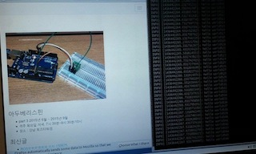
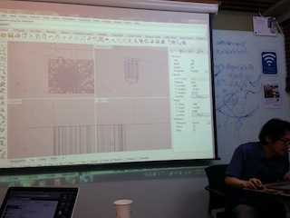

## ROS-4 ROS개념정리
발표자 : [정우철](https://www.facebook.com/juczest)  

참고자료 : 

[제3회 오픈 로보틱스 세미나 (제7세션) : 로봇운영체제ROS 개론 - 표윤석님]  

(http://www.slideshare.net/yoonseokpyo/3-7-48689858)  

  

1 . ROS 설치
$ wget https://raw.githubusercontent.com/oroca/oroca-ros-pkg/master/ros_indigo_install.sh
$ sh ros_indigo_install.sh  

2 . bashrc수정
$gedit ~/.bashrc  

아래내용 추가
source /opt/ros/indigo/setup.bash
source ~/catkin_ws/devel/setup.bash
export ROS_MASTER_URI=http://localhost:11311
export ROS_HOSTNAME=localhost

\#set ROS alias command

alias cw='cd ~/catkin_ws'
alias cs='cd ~/catkin_ws/src'
alias cm='cd ~/catkin_ws && catkin_make'

3 . 
$ source ~/.bashrc 

4 .
$ cd ~/catkin_ws/src
$ catkin_create_pkg my_first_ros_pkg std_msgs roscpp

5 . 
package.xml 수정
아래 txt파일 참고
http://arduberryspin.github.io/doc/part3/week02/package.txt

6 .
CMakeLists.txt수정
아래 txt파일 참고
http://arduberryspin.github.io/doc/part3/week02/CMakeLists.txt

7 .
소스코드작성
$ cd catkin_ws/src/my_first_ros_pkg/src/
$ nano hello_world_node.cpp
아래 txt파일 참고
http://arduberryspin.github.io/doc/part3/week02/hello_world_node.txt

8 .
패키지 빌드

$ rospack profile
$ cd ~/catkin_ws && catkin_make

9 . 실행

$ roscore
$ rosrun my_first_ros_pkg hello_world_node
  
  
  
참고문헌 : ROS 로봇 프로그래밍 (표윤석 저)  

## 보강:3D모델링

발표자 : [정우철](https://www.facebook.com/juczest)  

  

참고자료 : 

http://www.rhino3d.com/download  

"취업준비와 실무능력 향상을 위한 라이노 3D 4.0 (심봤다)" - 혜지원 -  