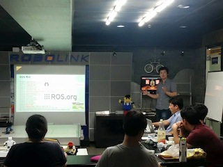

### 아두베리스핀
- PART3 ROS 로봇 프로그래밍 / 개인프로젝트 
- 2015년 6월 ~ 2015년 9월
- 격주 목요일 저녁. 7시 30분~10시
- 장소 : 한국 글로벌 널리지 (선릉역-역삼역 중간)

### 최신글
- [제 7장 ROS 기본 프로그래밍](doc/part3/d05.md)
- [모임후기-150723](doc/after.md)

### 링크
- [facebook ](https://www.facebook.com/groups/arduberryspin/)

### 일정
<iframe width="100%" height="600px" src="https://docs.google.com/spreadsheets/d/1KzZcM6x-u9a60eu-T2RIOFEoYBGiwte8L49Thxjllxo/edit#gid=1412315552"></iframe>
